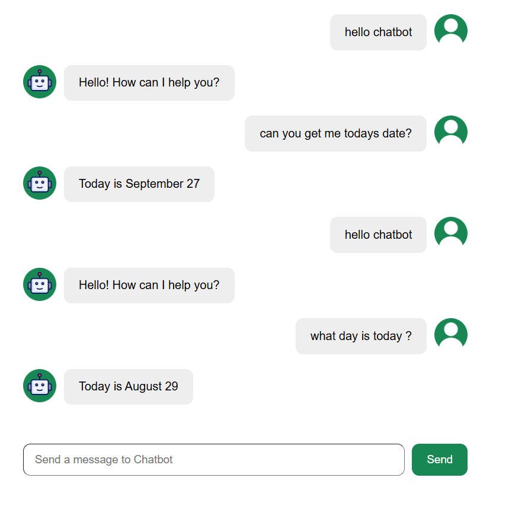

# Small ChatBot 💬

[](https://github.com/your-username/your-repo/stargazers)
[](LICENSE)
[](https://reactjs.org/)
[](https://developer.mozilla.org/en-US/docs/Web/CSS)

A **small, lightweight chatbot** built with **React.js** and **CSS**. Perfect for embedding in websites, learning React basics, or experimenting with interactive UI components.

---

## 🌟 Demo

Here’s a screenshot of the chatbot in action:



Or try the **[Live Demo](https://your-website.com)**.

---

## 🚀 Features

- Lightweight and responsive chatbot UI
- Easy to integrate into any React project
- Simple CSS styling for quick customization
- Beginner-friendly: perfect for learning React and UI concepts

---

## ⚡ Installation

1. **Clone the repository**

```bash
git clone https://github.com/your-username/your-repo.git
```

````

2. **Install dependencies**

```bash
npm install
```

3. **Start the development server**

```bash
npm start
```

4. **Open in browser**

```
http://localhost:3000
```

---

## 🛠 Built With

- [React.js](https://reactjs.org/)
- [CSS](https://developer.mozilla.org/en-US/docs/Web/CSS)
- React Hooks

---

## 📈 Roadmap

- Add customizable responses
- Dark/light mode toggle
- Persistent chat history using local storage
- Improve mobile responsiveness

---

## 🤝 Contributing

Contributions, issues, and feature requests are welcome!

1. Fork the repository
2. Create your branch (`git checkout -b feature-name`)
3. Commit your changes (`git commit -m 'Add new feature'`)
4. Push to the branch (`git push origin feature-name`)
5. Open a Pull Request

---

## ⭐ Show Your Support

If you like this project, give it a ⭐ on GitHub!

---

## 📄 License

This project is licensed under the **MIT License**.

```

---


```
````
